# ReasonateAI — Architecture

Canonical architecture reference. [`SPEC.md`](./SPEC.md) is authoritative for the product contract and security invariants; [`PHASE.md`](./PHASE.md) is authoritative for current scope and status. This document explains **how the system is put together** and is updated when a boundary, deployment topology, or data flow changes.

### Status legend

| Marker | Meaning |
| --- | --- |
| ✅ | Implemented and verified by tests |
| 🟡 | Partially implemented |
| ⬜ | Designed, not yet built |

---

## 1. What the system does

ReasonateAI is an autonomous AI CTO. A non-technical user describes a product; the system specifies it, plans it, obtains approval, builds it in an isolated sandbox, verifies it in a real browser, repairs what fails, and deploys it to a shareable URL.

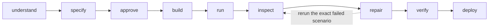

The product is **not** a code generator and **not** a coding TUI. The accountable differentiator is that it owns the lifecycle end to end and returns a running product at a URL.

---

## 2. System context

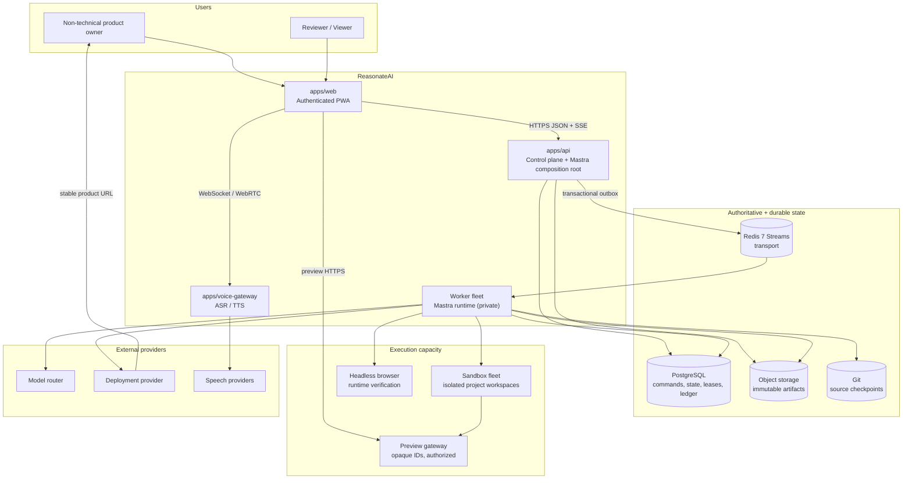

**Public surfaces** are only `apps/web`, the authenticated `apps/api` product routes, the voice gateway, and authorized preview URLs. Everything else is private infrastructure with no inbound client traffic.

---

## 3. Control plane and execution plane

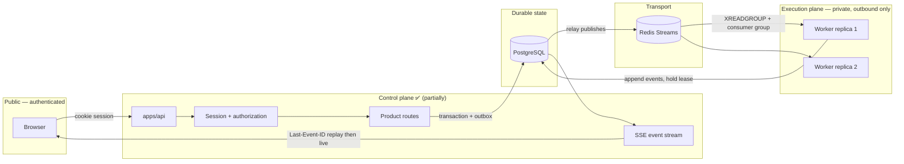

### Why this split exists

| Concern | Control plane | Execution plane |
| --- | --- | --- |
| Latency | Must answer in milliseconds | Runs for minutes |
| Scaling | Scales with users | Scales with concurrent builds |
| Blast radius | Public attack surface | Isolated, no inbound traffic |
| Failure mode | Restart is cheap | Must survive restarts mid-run |

**Mastra's documented topology supports this without a second application.** One Mastra codebase produces two artifacts:

```bash
mastra build                                    # → .mastra/output        API role
mastra worker build --output-dir .mastra/worker # → .mastra/worker        worker role
```

The same code runs as different container roles selected by `MASTRA_WORKERS`:

| Value | Role |
| --- | --- |
| `false` | API process; runs no workers |
| `orchestration` | Pulls workflow/step events; calls back over `MASTRA_STEP_EXECUTION_URL` |
| `backgroundTasks` | Runs background tool calls |
| `scheduler` | Single replica polling schedules |

Both roles share PostgreSQL and `RedisStreamsPubSub`. `apps/api/src/mastra` is therefore the composition root, not an application that owns agent logic. Agent policy lives in `packages/cto-runtime`.

---

## 4. Trust boundaries

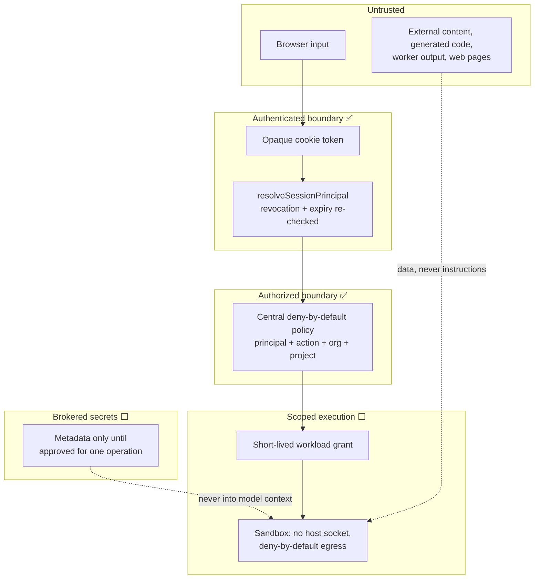

**Invariants enforced at these boundaries**

- A session cookie is opaque; only its SHA-256 digest is stored.
- Revocation and expiry are re-checked where a cookie becomes a principal, not only in storage.
- Every tenant-owned row carries `organization_id` and `project_id`; queries never filter cross-tenant results in application code.
- Object keys and URLs are never proof of access; signed access is issued after authorization.
- Raw Mastra route groups are denied at ingress.

---

## 5. First request — allocation and reconnect

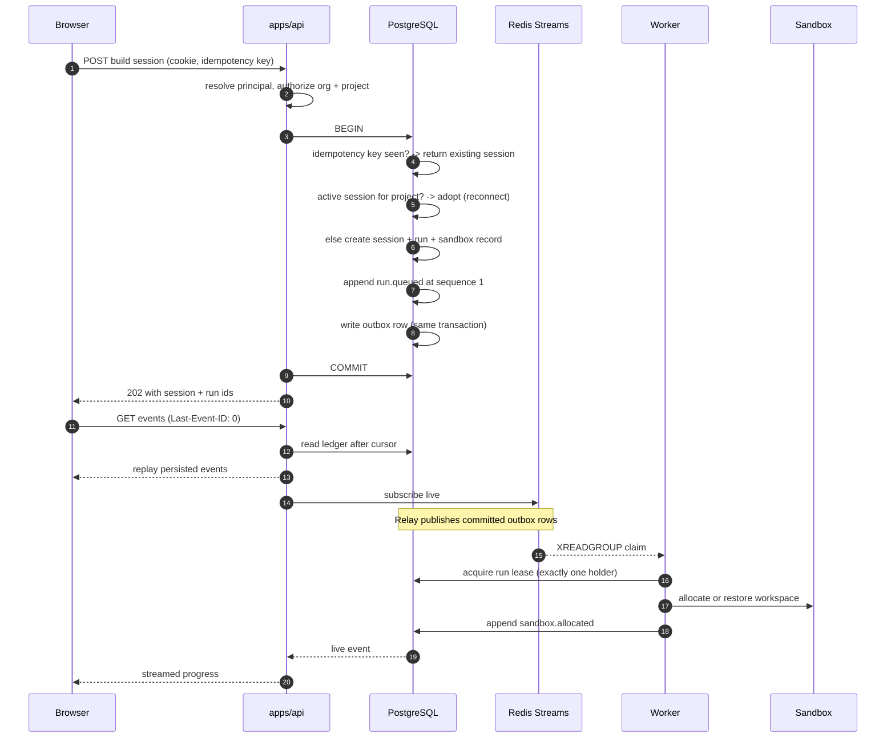

**Why one active session per project:** a partial unique index enforces it, so a repeat request reconnects to the existing workspace instead of silently creating a second, disconnected project.

---

## 6. Run lifecycle and event flow

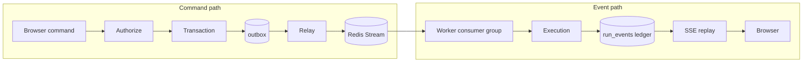

The ledger is the record of user-visible truth. Redis carries messages; it never holds the only copy.

| Concern | Owner | Guarantee |
| --- | --- | --- |
| Command durability | PostgreSQL `outbox` | Written in the same transaction as the state change |
| Delivery | Redis Streams | At-least-once, with reclaim and a bounded attempt cap |
| Deduplication | Consumer, by `eventId` | `event_id` is `UNIQUE` in the ledger |
| Browser resume | `run_events` | Contiguous per-run `sequence` from 1; cursor `0` = from the start |
| Single runner | `run_leases` | One holder per run, with expiry |

---

## 7. Agent delegation

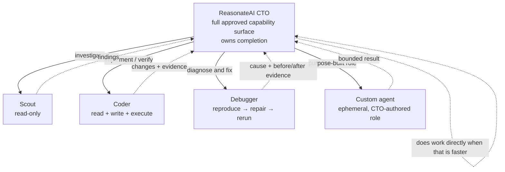

Frontend, backend, database, infrastructure, accessibility, security, and release engineering are **task objectives**, not permanent agent identities. Parallel work may share a project workspace only under task ownership and per-file mutation locks.

---

## 8. Storage model

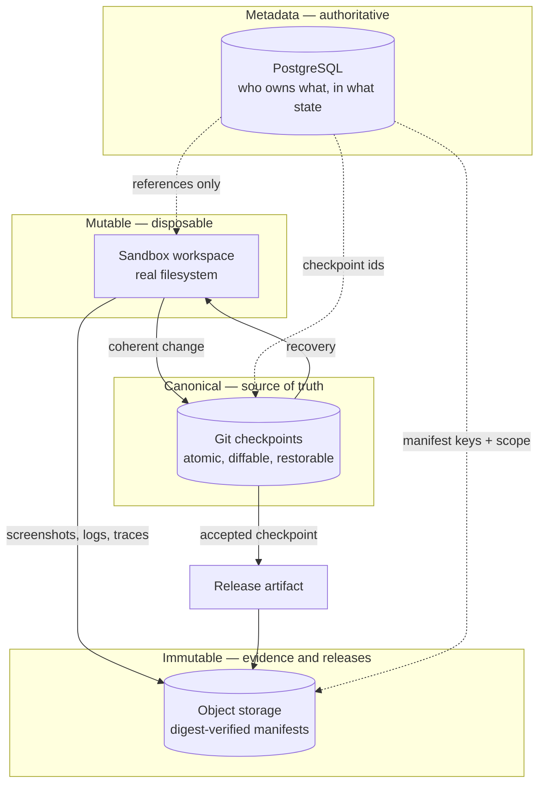

A complex generated project is **never** a single database object. It is a filesystem, a Git history, and a set of immutable artifacts, with metadata and authorization in PostgreSQL.

---

## 9. Data model

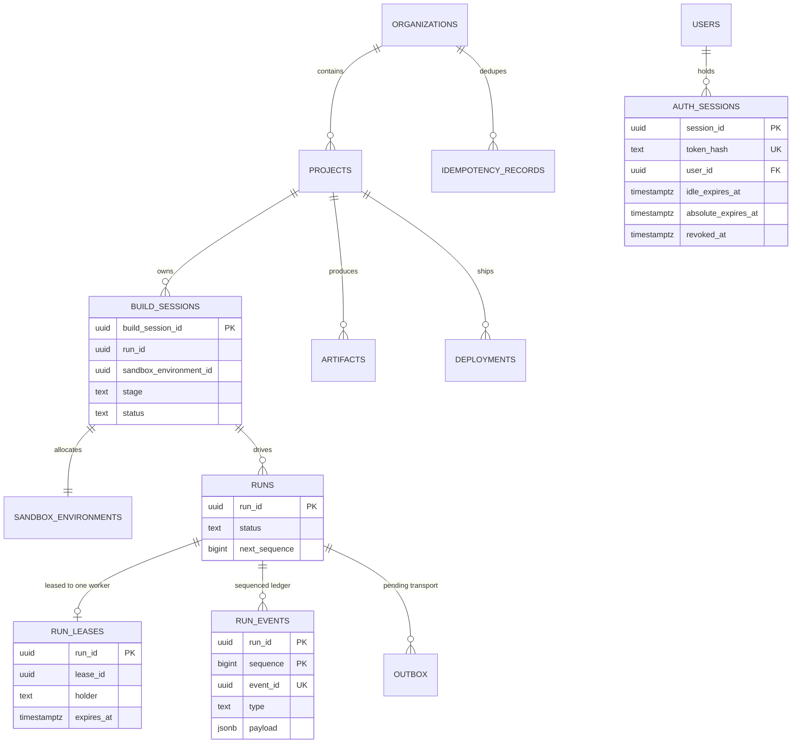

Full DDL and the invariants it encodes are in [`../packages/project-state/src/schema.ts`](../packages/project-state/src/schema.ts) and [`../packages/project-state/src/session-schema.ts`](../packages/project-state/src/session-schema.ts).

---

## 10. Deployment topology

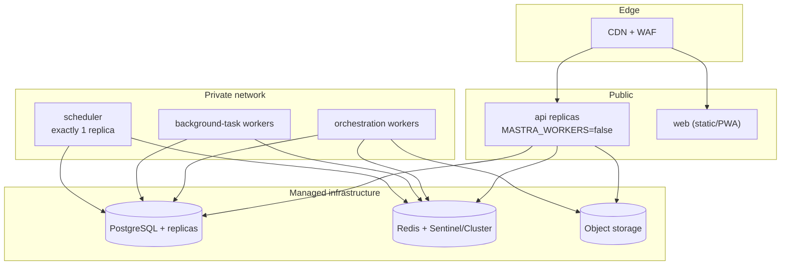

| Surface | Intent |
| --- | --- |
| `app.reasonate.ai` | Authenticated product |
| `api.reasonate.ai` | Control-plane API |
| `preview-<opaque-id>.preview.reasonate.ai` | Authorized sandbox preview |
| `<project>.reasonate.app` | Promoted user deployment |
| `agent-worker.internal` | Private, no inbound client traffic |

**Open item:** single Redis is a single point of failure. Sentinel or Cluster is required before production.

---

## 11. Component map

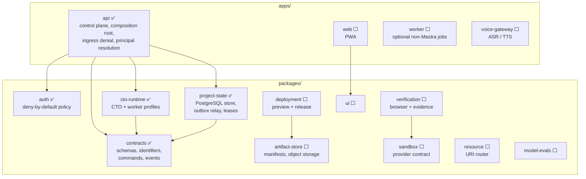

Per-component documentation: [`../docs/README.md`](../docs/README.md).

---

## 12. Security invariants

Non-negotiable, from [`SPEC.md`](./SPEC.md):

1. Generated code never receives host Docker sockets or control-plane credentials.
2. Untrusted execution uses deny-by-default or explicitly allowlisted egress.
3. Internal resources are scoped by user, organization, project, session, agent, and capability.
4. Path traversal and symlink escape are rejected.
5. Bundled skills and sealed artifacts are immutable.
6. Every state-changing tool call and security-sensitive action is auditable.
7. Tool retries, agent turns, process time, resource consumption, and spend are bounded.
8. Repeated identical behaviour triggers doom-loop protection.
9. External content is untrusted data, never instructions.
10. Authentication, authorization, secrets, audit, and tenant isolation cannot be bypassed for demonstrations.
11. Raw Mastra agent, controller, Studio, and worker routes are never publicly reachable.
12. A controller session is process-local convenience state, never an authorization or recovery authority.

---

## 13. Maintaining this document

Update this file when any of the following changes:

- A service boundary, deployment unit, or network topology.
- A trust boundary or an authorization decision point.
- A data flow between components.
- The storage model or the ownership of a data class.
- A component's implementation status in the legend.

Diagrams are Mermaid so they render in GitHub, Notion, and most reviewers. Keep them structural, not decorative: if a diagram would not catch a reviewer's mistake, it does not belong here.
