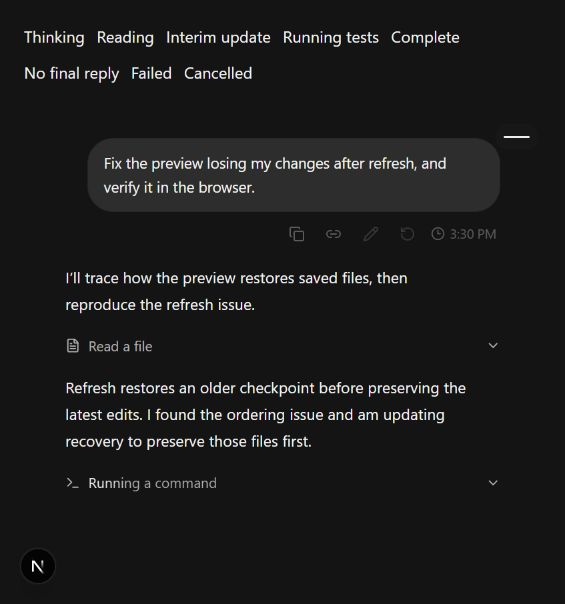
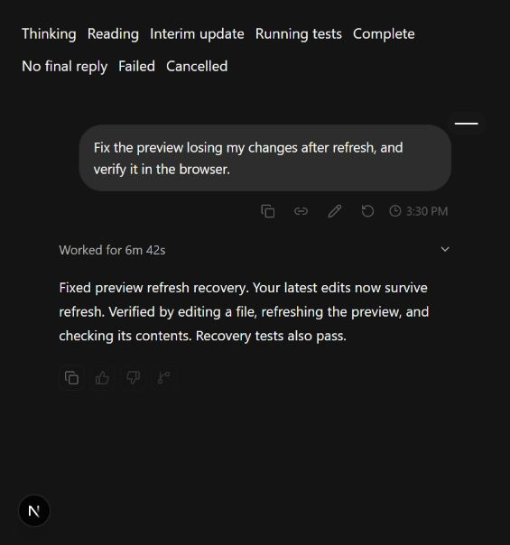
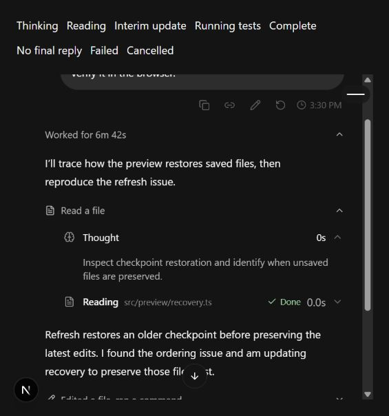

# Turn activity and completed history

Implemented on `codex/turn-activity-collapse`, October 7, 2026, in the isolated worktree at `C:\Users\wwwmo\.codex\worktrees\turn-activity-collapse\Reasonaeai-phase3`.

## Behavior

- Consecutive thinking/tool entries share activity groups while assistant progress separates those groups. Only the current action uses Shimmer. Finished summaries alphabetize existing action phrases; expanded entries retain chronological order.
- The durable worker outcome collapses earlier assistant progress, thinking, tools and resolved plans into a closed “Worked for…” row. Controller agent ends/errors cannot prematurely collapse or seal output.
- The final response alone stays outside history, including consecutive text parts from that source message. Copy uses that response. If a tool/thinking/plan boundary follows earlier prose and no final response arrives, the prose stays in history.
- Failure/cancellation remains visible, unanswered tool approvals become denied on turn end, active plan approval remains visible, and user steering retains its navigation anchors.
- Thinking and tool rows share icon/text columns. Timestamp localization happens after hydration for both user and assistant controls.
- Shimmer follows the [AI Elements interface/gradient](https://elements.ai-sdk.dev/components/shimmer), adapted to CSS with reduced-motion support and existing theme variables. No dependency was added.

Integrated company `main` at `ea62afd` before final verification; frozen install, lint, type checking, all 182 web tests and the complete production build passed again on the integrated branch.

## Verification

| Command/scenario | Result |
| --- | --- |
| `pnpm install --frozen-lockfile` | Passed; unchanged lockfile, 866 packages |
| `pnpm check` | Passed, 416 files |
| `pnpm typecheck` | Passed, 10 workspace tasks |
| `pnpm --filter @reasonateai/web test` | Passed, 23 files and 182 tests |
| `pnpm build` | Passed, 10 workspace tasks; web and API rebuilt |
| `pnpm audit --prod --audit-level high` | Passed threshold; two low and two moderate advisories remain, no high/critical |
| `git diff --check` | Passed |
| Gitleaks 8.30.1 over the staged feature-file snapshot, `--redact --no-banner` | Passed; no leaks across 262 KB; official release checksum verified before execution |
| Built web smoke on port 3227 | Product root HTTP 200; temporary verification route HTTP 404 |
| Independent ephemeral review | Both reported lifecycle/plan-boundary defects repaired; re-review found no actionable feature defect; 39 focused tests passed |
| [PR #38 clean CI](https://github.com/Ashutosh26-uu/Reasonaeai-phase3/actions/runs/37618857143), code commit `73b163a` | Passed frozen install, lint, typecheck, build, full root test gate (17 tasks), real checkpoint smoke, built API health/private-route denial and dependency/secret scans |

Browser verification used the actual `Transcript` component in the running Next.js application, fed schema-validated sequenced ledger snapshots by a temporary local verification route. It covered thinking → read → interim prose → edit/test → completion, expansion/collapse of history and activity groups, preserved reasoning content, no final reply, failure and cancellation. Reload of a completed fixture rebuilt the same default-closed history and final answer with no new browser errors. The active command's computed animation duration was 2 seconds. Thinking/tool icon and text x coordinates matched exactly (0 px difference). Copy reported success for the final response.

The initial browser check exposed a pre-existing locale hydration mismatch (`pm` on the server, `PM` in the browser); the shared browser-local timestamp component fixes both user and assistant timestamp surfaces. The temporary route was removed before the production build and is not shipped.

## Remaining acceptance gate

`pnpm test` was attempted but failed in the unchanged `@reasonateai/sandbox` Mastra adapter integration test: container `reasonate-sbx-66666666-6666-4666-8666-666666666666` was already owned by a parallel session. That run reported 25 passing sandbox tests, one collision failure and four skipped checkpoint tests before aborting the workspace gate. Other sessions' infrastructure was left untouched. A passing root test gate is not claimed.

Clean CI subsequently passed the complete root test gate with dedicated PostgreSQL/Redis/Docker, including the fixture that collided locally. An authenticated API/private-worker browser journey remains an acceptance prerequisite. Browser evidence here verifies rendering/replay of real component inputs, not a fresh model-driven authenticated run. This limit keeps the feature in progress in `.context/PHASE.md` and PR #38 in draft.

## Security, deployment and recovery

This is a private web application change with no API, database, persisted event schema, permission, authorization, tenant isolation or secret-broker changes. Existing tool-detail redaction is retained; screenshots contain only verification fixture data. No migration, data rollback, package publication or changeset is applicable.

Deploy only after required review/CI using the existing immutable-artifact pipeline. Recover by reverting the feature commit and rebuilding the web artifact: no persisted transcript data needs alteration. All chronology and reasoning remain in the existing ledger. No performance budget or new throughput claim is made; the browser check verifies the actual display path.
